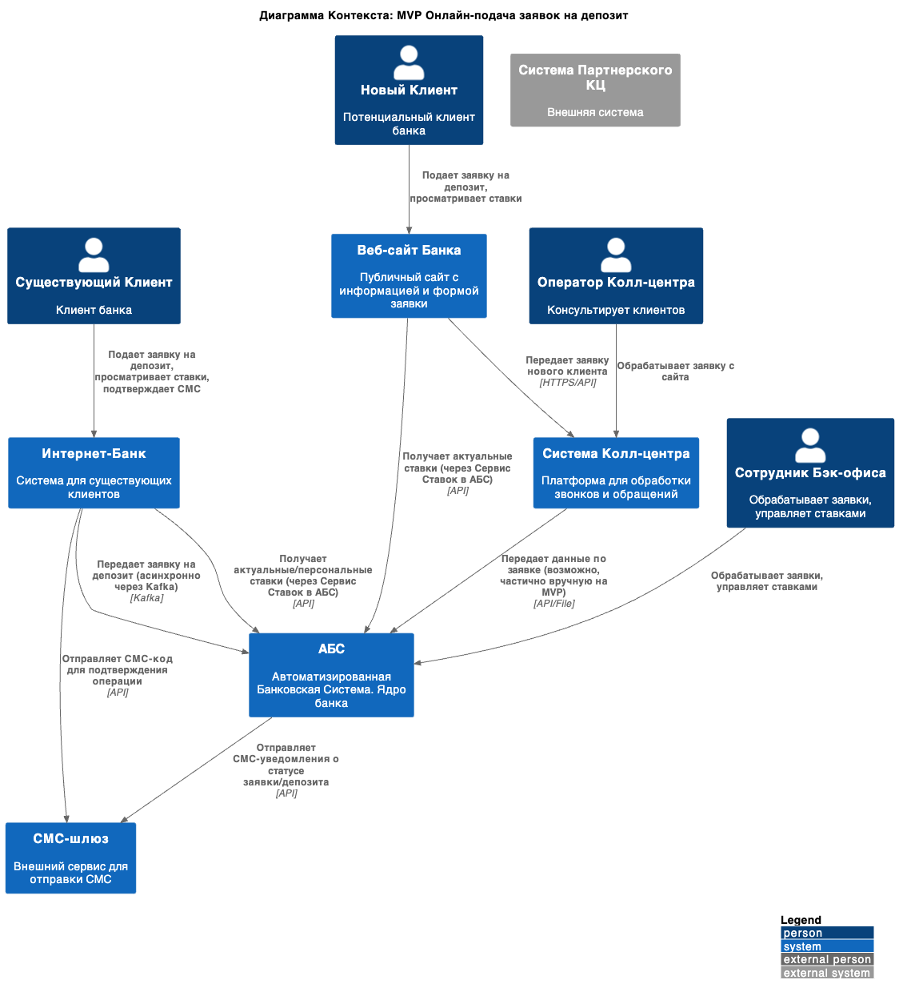
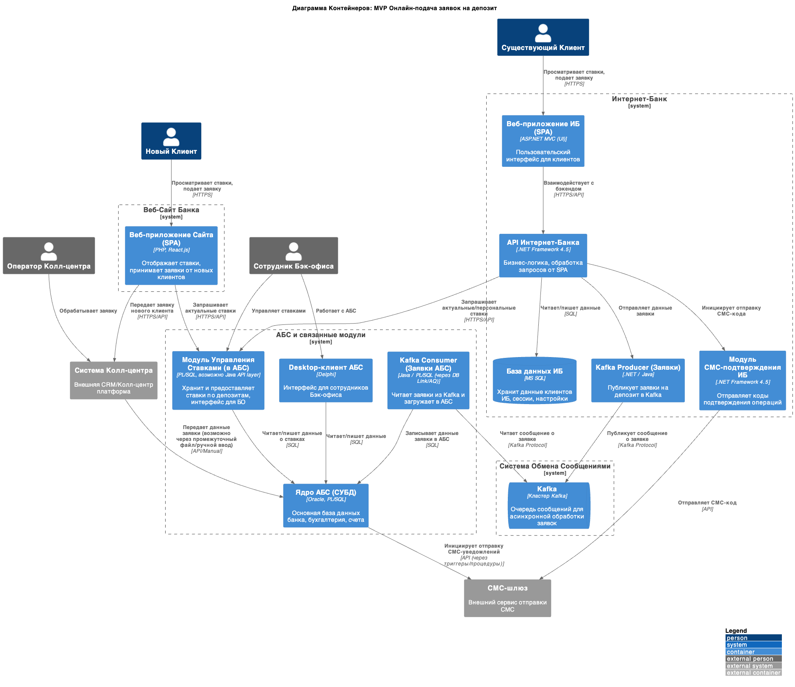

# Architecture Decision Record: Открытие депозитов онлайн (MVP)

### **Название задачи:** 
Разработка MVP для онлайн-открытия депозитов в банке "Стандарт"

|**№**|**Действующие лица или системы**|**Use Case**|**Описание**|
| :-: | :- | :- | :- |
|UC1|Новый клиент, Сайт, Кол-центр|Подача заявки на депозит на сайте|1. Клиент заходит на сайт банка 2. Клиент просматривает список доступных депозитов с актуальными ставками 3. Клиент заполняет форму заявки (Ф.И.О., номер телефона) 4. Система сохраняет заявку и передает ее в систему кол-центра 5. Менеджер кол-центра обрабатывает заявку и связывается с клиентом 6. Система отправляет СМС-уведомление клиенту о статусе заявки|
|UC2|Существующий клиент, Интернет-банк, АБС|Подача заявки на депозит в интернет-банке|1. Клиент авторизуется в интернет-банке 2. Клиент просматривает список доступных депозитов с актуальными и персонализированными ставками 3. Клиент заполняет заявку, указывая счет списания и сумму депозита 4. Система запрашивает подтверждение операции через СМС-код 5. Клиент вводит полученный СМС-код 6. Система создает заявку и передает ее в АБС 7. Система отправляет СМС-уведомление о создании заявки|
|UC3|Менеджер бэк-офиса, АБС|Обработка заявки на открытие депозита|1. Менеджер бэк-офиса получает уведомление о новой заявке в АБС 2. Менеджер проверяет данные заявки 3. Менеджер согласовывает ставку по депозиту  4. Менеджер подтверждает открытие депозита в АБС 5. АБС создает депозитный счет 6. АБС инициирует отправку СМС-уведомления клиенту об открытии депозита|
|UC4|Менеджер бэк-офиса депозитов, Менеджер бэк-офиса кредитов, АБС|Управление ставками по депозитам|1. Менеджер бэк-офиса кредитов анализирует уровень кредитного риска 2. Менеджер вносит базовые параметры для расчета ставок в модуль управления ставками АБС 3. Менеджер бэк-офиса депозитов получает доступ к параметрам 4. АБС автоматически рассчитывает текущие ставки по депозитам 5. Обновленные ставки становятся доступны на сайте и в интернет-банке|

### **Нефункциональные требования**
Нефункциональные и архитектурно-значимые требования:

|**№**|**Требование**|
| :-: | :- |
|NF1|Доступность всех сервисов 24/7 с уровнем доступности 99,9%|
|NF2|Быстрый отклик по всем операциям (миллисекунды)|
|NF3|Время загрузки справочных данных в интерфейсе интернет-банка должно занимать меньше секунды|
|NF4|Равномерное горизонтальное масштабирование и распределение запросов|
|NF5|Избегать прямой работы интернет-банка с API АБС|
|NF6|Использование существующих баз данных MS SQL и Oracle|
|NF7|Новые технологии должны быть совместимы с существующими платформами разработки|
|NF8|Шифрование трафика при передаче чувствительных данных|
|NF9|Разделение доступа к данным между сотрудниками депозитов и кредитов|
|NF10|Избегать доработок ядра системы интернет-банка на стороне подрядчика|
|NF11|Обеспечение работоспособности интернет-банка в случае сбоев в ЦОД|
|NF12|Обеспечение работоспособности АБС при увеличении нагрузки от онлайн-заявок|

### **Решение**

Предлагаемая архитектура разработана с учетом существующей IT-инфраструктуры банка и необходимости минимизации рисков при внедрении новой функциональности. 

#### Диаграмма контекста (C4 модель)

Диаграмма отображает высокоуровневое взаимодействие между основными субъектами и системами: клиентами (новыми и существующими), сотрудниками банка (фронт-офис и бэк-офис) и основными IT-системами (сайт, интернет-банк, АБС, система кол-центра, СМС-шлюз).

#### Диаграмма контейнеров (C4 модель)

### **Альтернативы**

1. **Полная микросервисная архитектура интернет-банка**
   - Полная переработка интернет-банка с переходом на микросервисную архитектуру
   - Преимущества: лучшая масштабируемость, гибкость и отказоустойчивость
   - Недостатки: значительно более длительные сроки реализации, высокая стоимость, риски миграции
   - Решение: отложить до следующих этапов трансформации, начав с частичного внедрения микросервисов

2. **Прямая интеграция интернет-банка с АБС**
   - Непосредственное взаимодействие интернет-банка с АБС без промежуточных слоев
   - Преимущества: простота реализации, меньше компонентов системы
   - Недостатки: высокая нагрузка на АБС, риск отказа всей системы
   - Решение: отказаться в пользу архитектуры с API-шлюзом

3. **Разработка полностью новой системы для управления депозитами**
   - Создание отдельной системы вне АБС для управления депозитами
   - Преимущества: независимость от ограничений АБС, современные технологии
   - Недостатки: дублирование данных, сложная синхронизация с АБС, высокая стоимость
   - Решение: отказаться в пользу доработки АБС

### **Недостатки, ограничения, риски**

1. **Недостатки выбранного решения**
   - Сохраняется зависимость от устаревшей системы АБС
   - Повышается сложность системы за счет введения дополнительных компонентов
   - Асинхронный подход может усложнить обработку ошибок и отладку

2. **Ограничения**
   - АБС масштабируется только вертикально из-за архитектуры СУБД Oracle
   - Интернет-банк остается монолитным, что ограничивает возможности масштабирования
   - Интеграция с кол-центром ограничена возможностями системы подрядчика

3. **Риски**
   - Недостаточная производительность API-шлюза при росте нагрузки
   - Сложности при внедрении модуля управления ставками в АБС
   - Риск нарушения работы существующего функционала АБС
   - Сложности с обеспечением требуемого уровня доступности (99,9%)
   - Необходимость координации работы нескольких IT-команд может привести к задержкам
