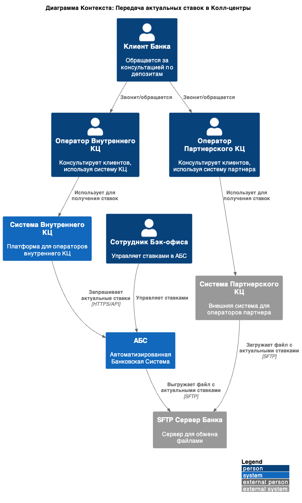
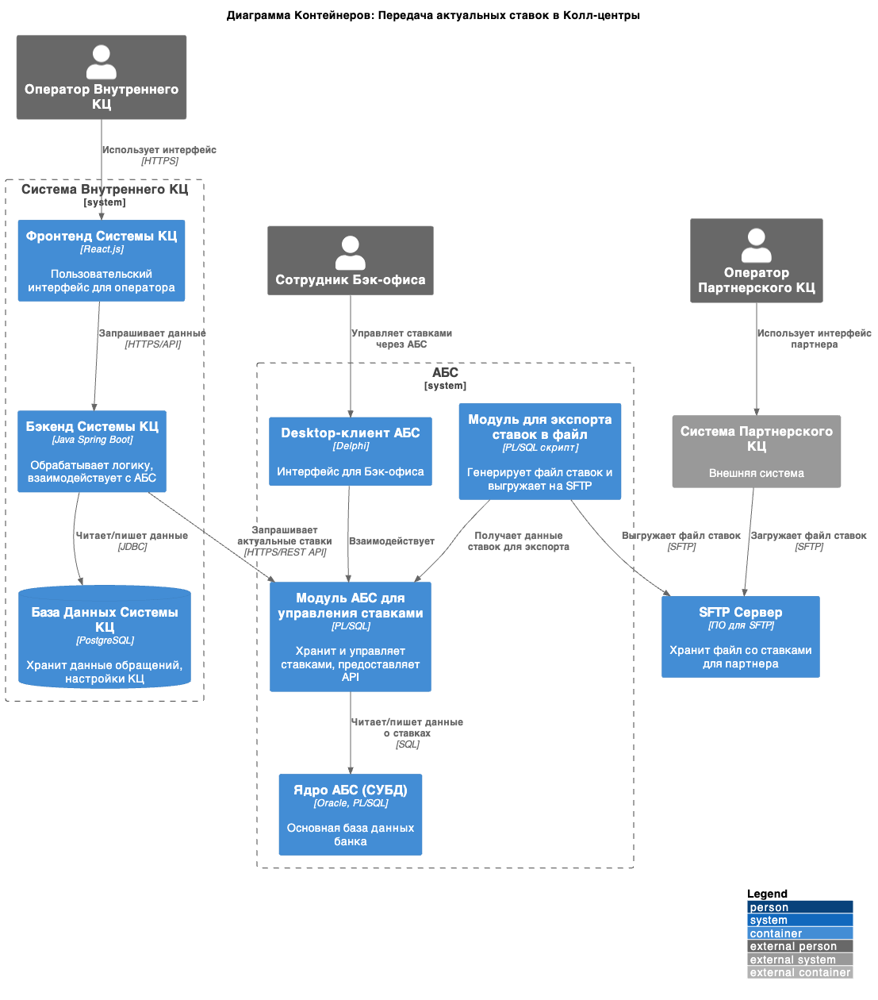

## Передача актуальных ставок в Колл-центры (внутренний и партнерский)

**Название задачи:** Обеспечение Колл-центров актуальной информацией о ставках по депозитам

**Функциональные требования**

|**№**|**Действующие лица или системы**|**Use Case**|**Описание**|
| :-: | :- | :- | :- |
| UC1 | Сотрудник Колл-центра (внутренний), Система Колл-центра (внутренняя), Модуль Управления Ставками (в АБС) | Получение и отображение актуальных ставок по депозитам сотрудником внутреннего Колл-центра | 1. Сотрудник внутреннего Колл-центра получает звонок/обращение от клиента.   2. Сотруднику для консультации необходима информация об актуальных ставках по депозитам.   3. Система Колл-центра (внутренняя) запрашивает актуальные (не персонализированные, а общие) ставки из Модуля Управления Ставками в АБС по API.   4. Система Колл-центра отображает полученные ставки сотруднику в его интерфейсе. |
| UC2 | Сотрудник Партнерского Колл-центра, Система Партнерского Колл-центра, Модуль Управления Ставками (в АБС), SFTP-сервер | Получение и отображение актуальных ставок по депозитам сотрудником Партнерского Колл-центра | 1. Сотрудник Партнерского Колл-центра получает звонок/обращение от клиента.   2. Сотруднику для консультации необходима информация об актуальных ставках по депозитам.   3. Система Банка (АБС или отдельный скрипт) регулярно (например, ежедневно) формирует файл (например, CSV/XML) с актуальными общими ставками по депозитам.   4. Сформированный файл выгружается на SFTP-сервер Банка.   5. Система Партнерского Колл-центра (или их IT-процесс) регулярно забирает файл с SFTP-сервера Банка.   6. Система Партнерского Колл-центра импортирует данные из файла и отображает актуальные ставки сотруднику в его интерфейсе. |
| UC3 | Модуль Управления Ставками (в АБС), Ответственный сотрудник Банка, SFTP-сервер | Регулярное формирование и выгрузка файла ставок для Партнерского Колл-центра | 1. Ответственный сотрудник Банка (или автоматизированный процесс) инициирует выгрузку актуальных ставок.   2. Модуль Управления Ставками (в АБС) (или специальный скрипт, использующий его данные) генерирует файл с актуальными общими ставками в согласованном формате.   3. Сгенерированный файл автоматически выгружается на SFTP-сервер Банка. |

**Нефункциональные требования**

|**№**|**Требование**|
| :-: | :- |
| U1  | Интерфейс отображения ставок в Системе Колл-центра (внутреннего) должен быть интуитивно понятным и обеспечивать быстрый доступ к информации. |
| R1  | Данные о ставках, предоставляемые Колл-центрам, должны быть актуальными (обновление минимум раз в день для партнерского КЦ, для внутреннего - real-time или близко к нему). |
| R2  | Процесс передачи файла ставок на SFTP-сервер должен быть надежным. |
| P1  | Запрос ставок из Системы Колл-центра (внутреннего) к API Модуля Ставок АБС должен выполняться быстро (не более 1-2 секунд). |
| S1  | Формат файла для Партнерского Колл-центра должен быть четко документирован и согласован. |
| S2  | Должна быть предусмотрена возможность изменения формата файла или параметров API с минимальными усилиями. |
**Решение**

**Диаграммы C4:**

**1. Диаграмма Контекста (C4 Context Diagram) - Передача ставок в КЦ**

**2. Диаграмма Контейнеров (C4 Container Diagram) - Детализация АБС и Системы Внутреннего КЦ**

**Альтернативы**

1.  **Ручная передача файла ставок Партнерскому КЦ (например, по email):**
    *   *Недостатки:* Ненадежно, высокий риск человеческой ошибки, сложно обеспечить регулярность и актуальность, небезопасно.
2.  **Разработка отдельного веб-интерфейса для Партнерского КЦ для просмотра ставок:**
    *   *Недостатки:* Более трудоемко, чем выгрузка файла. Партнер все равно может предпочесть интеграцию данных в свою систему, а не заставлять операторов переключаться между системами. Противоречит их ограничению "нет API-вызовов" если бы они должны были тянуть данные.
3.  **Использование общей базы данных для внутреннего КЦ вместо API:**
    *   *Недостатки:* Более сложная настройка, риски для основной БД АБС, менее гибко, чем API. API лучше подходит для микросервисной архитектуры системы КЦ.
4.  **Push-уведомления об изменении ставок во внутренний КЦ (вместо pull по API):**
    *   *Рассмотрение:* Могло бы быть более эффективным, если ставки меняются редко.
    *   *Недостатки для MVP:* Сложнее в реализации (требует брокера сообщений или WebSocket), чем простой pull по API. Для MVP достаточно pull.

### **Недостатки, ограничения, риски**

1.  **Актуальность файла для Партнерского КЦ:** Данные в файле будут актуальны на момент его генерации. Если ставки изменятся в течение дня, партнерский КЦ узнает об этом только со следующим файлом.
2.  **Формат файла:** Необходимо строгое соблюдение согласованного формата файла. Любые изменения формата потребуют координации с партнером.
3.  **Зависимость от SFTP-сервера:** Если SFTP-сервер недоступен, партнерский КЦ не сможет получить файл.
4.  **Безопасность учетных данных SFTP:** Необходимо обеспечить безопасное хранение и передачу учетных данных для SFTP партнеру.

---

## 2. Список крупных задач для каждой системы (для интеграции ставок в КЦ)

**АБС:**
1.  Разработка и тестирование API (REST/JSON) для предоставления актуальных общих (не персонализированных) ставок по депозитам. Включает документацию API.
2.  Разработка и тестирование модуля/скрипта (PL/SQL или Java) для экспорта актуальных общих ставок в файл.
3.  Настройка автоматического регулярного запуска модуля/скрипта экспорта (например, ежедневно).
4.  Обеспечение мер безопасности для API (аутентификация, авторизация).

**IT-Инфраструктура / Команда IT-поддержки:**
1.  Развертывание/настройка SFTP-сервера или выделение ресурсов на существующем.
2.  Настройка директории и прав доступа на SFTP-сервере для выгрузки файла ставок АБС.
3.  Предоставление учетных данных и инструкций по доступу к SFTP-серверу для Партнерского Колл-центра.

**Система Колл-центра (внутреннего):**
1.  Разработка и тестирование клиента для интеграции с API АБС (получение ставок).
2.  Проектирование и реализация изменений в интерфейсе оператора для отображения актуальных ставок.
3.  Реализация логики запроса, обработки и отображения ставок в бэкенде Системы КЦ.
4.  Комплексное тестирование функционала получения и отображения ставок.

**Партнерский Колл-центр:**
1.  Согласование формата и структуры файла ставок с Банком.
2.  Настройка на своей стороне процесса/скрипта для регулярного скачивания файла ставок с SFTP-сервера Банка.
3.  Разработка на своей стороне логики импорта данных из файла в свою систему.
4.  Отображение импортированных ставок в интерфейсе своих операторов.

